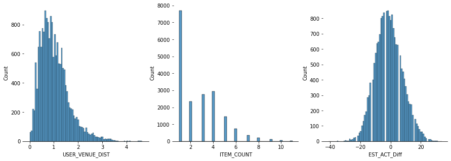
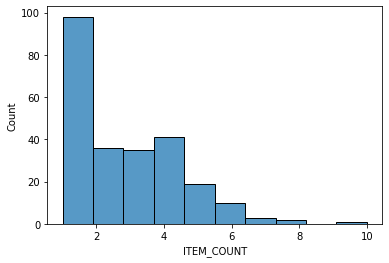

[Introduction](./../../index.md) | [Exploratory Analysis](./../pages/data_exploration.md) | [Forecasting Orders](./../pages/order_forecasting.md) |[Classifying Orders](./../pages/order_classification.md)

# Data Overview

This section investigates the relationships between features and the
individual characteristics of the variables of interest.

## Correlations

The matrix of correlations between variables indicates that most
variables have low correlations, meaning no structural causality can
be generated variables in their current form.

The image below shows the scatter plots of individual variables
against each other. As the scatter plots show, most variables do not
have a strong linear relationship among each other. Additionally, the
KDE plots show characterisitcs of the variables, only the EST_ACT_Diff
shows signs of a normal distributions while others have non-normal
distributions.

[back to top](./../pages/data_exploration.md)

## Distributions plots of Key Variables

The distribution of USER_VENUE_DIST shows that the average distance
between users and venue is about 1Km (1.02), the plot also shows a
tendancy to have distances that are further than 2Kms. ITEM_COUNT
distribution shows that orders with 1 item are dominant (average 2.6
items), interestingly, some orders may though rare may have more than
4 items. The EST_ACT_Diff variable represents the difference in
minutes between estimated time for a delivery and the actual time it
takes for the delivery to be completed. The distribution is
interestingly almost centered around zero (-1.2) but also shows signs
of under/over estimation of the time required to deliver the meals.

[back](./../pages/data_exploration.md)

##  Day of the week effect and orders per day

Similar to what was already observed, 1 item orders are more common,
this pattern is repeated also at a single day level, the graph below
shows distribution of orders on a single random day.

Intuitively, it is expected that some days of the week may have a
larger number of orders than others. The graph below shows the
disparity between orders across different days of the week.

The graph below shows that Sundays, Saturdays followed by Friday are
the most popular days with respect to orders. A weekly view shows a
similar pattern to a day view such that one item are most popular
across all the days of the week while orders with a large number of
items are few.

[back to top](./../pages/data_exploration.md)

## Orders  per hour

We can also try to understand the flow of orders on an hourly basis,
the data provided indicated orders in the minute frequency which made
it possible to coalesce the orders into a hourly basis. The graphs
below indicate a 1-day snapshot and a 7-day snapshot. As expected,
orders peak during lunch hours every day, forming a very cyclic
series.

[back to top](./../pages/data_exploration.md)
