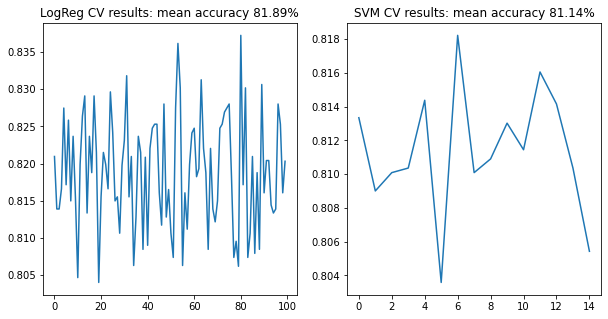

[Introduction](./../../index.md) | [Exploratory Analysis](./../pages/data_exploration.md) | [Forecasting Orders](./../pages/order_forecasting.md) |[Classifying Orders](./../pages/order_classification.md)

# Order Classification

A classification problem was also set up from the given data, this
section provides an overview of the models used and the results
obtained.

Each order was assigned a postal code based on Google map's
reversegeocode API that allows to estimate the location of an entity
given a point (lattitude, longitude).

Orders where the VENUE and USER share a common postal code is assigned
the class IN to imply the order has originated from the
code. Otherwise a class OUT is assigned to an order to indicate the
ORDER is received from outside the postal code. The table below
indicates most orders tend to originate outsided a postal code region,
the class imbalance is significant.

|	| IN | OUT |
|:------|:---|:----|
| ORDERS| 3983 | 14446 |
| (%)   | 21.6%| 78.4% |

A further evaluation of the averages of various features when
stratified by these classes indeed does indicate orders that are out
the the postal region tend to be 1.15Km away while those within a
postal region tend to be 560 meters away.

|   FEATURE   	      | IN (mean) | OUT (mean)|
|:--------------------|:----------|:----------|
| EST_ACT_Diff		     | -1.075320  | -1.242697 |
| ITEM_COUNT		     |2.749937 	  | 2.670566 |
| ESTIMATED_DELIVERY_MINUTES | 	31.217926 | 34.554340 |
| ACTUAL_DELIVERY_MINUTES    | 	30.142606 | 33.311643 |
| CLOUD_COVERAGE 	     | 12.410244  |11.882874 |
| TEMPERATURE 		     | 16.994502  |16.967756 |
| WIND_SPEED 		     | 3.781489	  |3.793611 |
| PRECIPITATION 	     | 0.320309   |0.342568 |
| USER_VENUE_DIST 	     |0.558221 	  |1.152561 |

[back to top](./../pages/order_classification.md)

## Classification Models
The classification models applied
- Logistic regression model
- Support Vector Machine (SVM)
- Decision Tree (still under evaluation)

The linear regression model was cross validated with 10 folds with 10
repetitions while the SVM model was cross validated using 5 folds with
3 repetitions each (performance constraints at higher
split-repeations)

The image below shows a comparison of the accuracy levels between the
logistic regression and SVM models.

[back to top](./../pages/order_classification.md)
