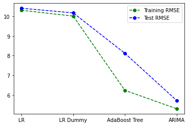
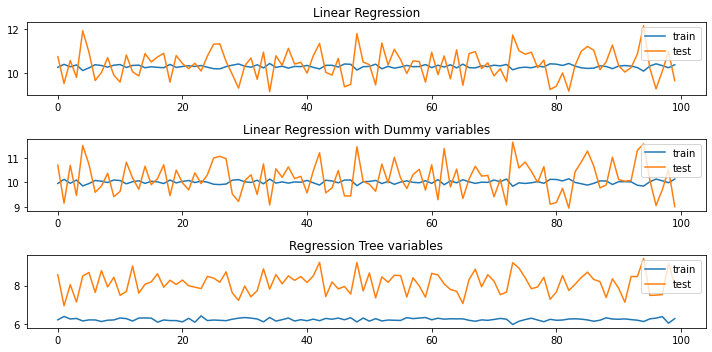
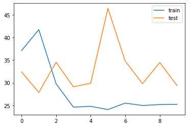

[Introduction](./../../index.md) | [Exploratory Analysis](./../pages/data_exploration.md) | [Forecasting Orders](./../pages/order_forecasting.md) |[Classifying Orders](./../pages/order_classification.md)

# Forecasting

Being able to forecast the amount of orders has the potential to
improve business efficiency, so the objective of this section was to
forecast the amount of incoming orders. 4 different models were
developed and tuned and their results compared

- A linear regression model
- A linear regression with dummy variables
- A regression tree model
- An ARIMA model

The main variable being predict(endog) is number of orders. This
variable is created by aggregating the amount of orders obtained per
day or per hour depending with the use case.

Cross validation setup for the linear regression model, model with
dummy variables and the boosted tree is based on repeated cross
validations (10 repeatitions of 10 splits). The ARIMA model is cross
validated based on rolling cross validation, where the data is split
into 10 testing folds.

A summary of the results between these models is summarised in the
image below, indicating a comparison of the RMSE values between all
models. Perfomance between a linear regression model with and without
weekday dummy variables obtain almost similar results. The boosted
tree model indicates improved performance compared to the linear model
versions, notably though there is a significant disparity between RMSE
values obtain between the train set and test set. Finally, the ARIMA
model provides the best results. An accompanying results table shows
the actual values

{: .center-block :}

|	| Train RMSE | Test RMSE |
|-------|------------|-----------|
| LR    | 10.31 | 10.41 |
| LR Dummy | 10.02 | 10.18 |
| Boosted Tree | 6.23 | 8.12 |
|ARIMA 	| 5.29 | 5.72 |

Details of each model and the tuning process has been outlined in the
subsections below.

## Linear Regression model (OLS)

Following the data exploration section, a linear regression model is
expected to provide weak results as the data involved showed very low
correlations. Nonetheless using it as a part of the model set would
provide a foundation for improvement.

Fitted model to be added here (mathjax)

[back to top](./../pages/order_forecasting.md)

## Linear regression model with dummy variables

Since weekdays were shown to have different order patterns, this model
explores if this patterns would result in a reasonable prediction
model.

[back to top](./../pages/order_forecasting.md)

## Regression Tree Model (Boosted Regression Tree)
trees are considered a good non-parametetric approach to this problem
since the data indicated lack of non-linear dependicies between features.

To identify a good estimator tree, grid search cross-validation and
randomised search cross-validation were applied.
grid search results: {'criterion': 'mse', 'max_depth': 5, 'max_features': 'sqrt'}
randomized search results: {'max_features': 'sqrt', 'max_depth': 5, 'criterion': 'friedman_mse'}

A boosted tree with max_depth=5, criterion='friedman_mse',
max_features='sqrt' was eventually fitted. Perhaps I should have also
compared results of the boosted tree from each of these methods
independently.

[back to top](./../pages/order_forecasting.md)

## An ARIMA Model

Given that the data indicated highly cyclic characteristics, it is
imperative that we test a dedicated timeseries model on the data. The
image below indicates cross validation performance between test and
train set.

[back to top](./../pages/order_forecasting.md)

